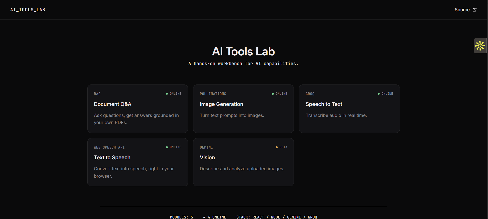
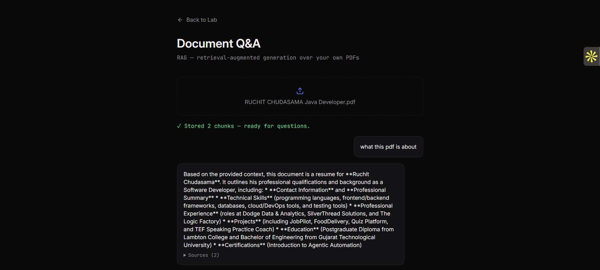
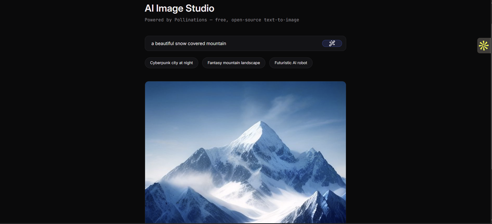
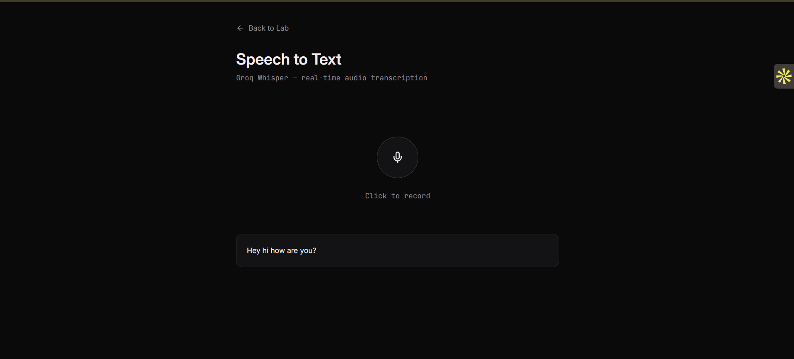
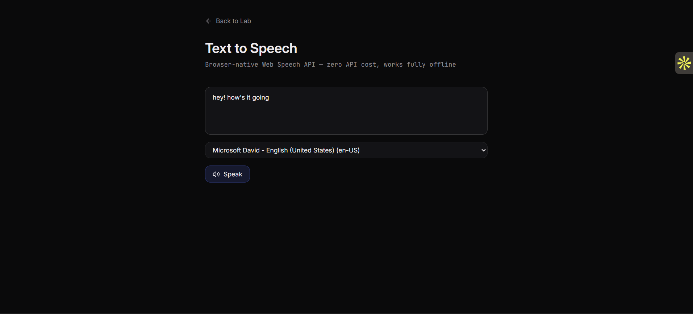
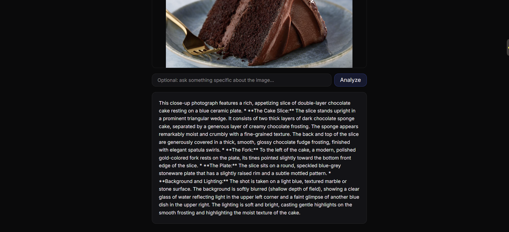

# NexaAI

A hands-on workbench for trying out AI capabilities — document Q&A, image generation, speech-to-text, text-to-speech, and image understanding — built as a full-stack project to learn how these APIs actually behave in practice, not just in theory.

**Live demo:** https://nexa-ai-one-opal.vercel.app
**Backend:** https://nexaai-pvwk.onrender.com

> Note: the backend runs on Render's free tier, which spins down after 15 minutes of inactivity. The first request after idle time may take 30-60 seconds to respond.

---

## Screenshots

**Home Page** — This is the Very first page when you visit website..


**Document Q&A (RAG)** — upload a PDF, ask questions grounded in its actual content, with source citations


**Image Generation** — text-to-image via Pollinations


**Speech to Text** — live microphone transcription via Groq Whisper


**Text to Speech** — browser-native speech synthesis, zero API cost


**Vision** — detailed image understanding via Gemini


---

## Modules

| Module | Provider | What it does |
|---|---|---|
| Document Q&A | Gemini (`gemini-flash-latest`, `gemini-embedding-001`) | Upload a PDF, ask questions, get answers grounded in the document with source citations (RAG) |
| Image Generation | Pollinations.ai | Text-to-image generation, free and open-source |
| Speech to Text | Groq (`whisper-large-v3-turbo`) | Record audio in the browser, get a real-time transcript |
| Text to Speech | Web Speech API (browser-native) | Convert typed text to spoken audio, no API or network call involved |
| Vision | Gemini (`gemini-flash-latest`) | Upload an image, get a detailed AI-generated description |

---

## Tech stack

- **Frontend:** React (Vite), Tailwind CSS v4, Framer Motion, React Router
- **Backend:** Node.js, Express
- **Testing:** Playwright (end-to-end, with mocked API responses)
- **Deployment:** Vercel (frontend), Render (backend)

---

## Architecture notes and tradeoffs

A few decisions here were shaped by real constraints, not just preference — worth explaining rather than hiding:

**In-memory vector store instead of a persistent vector database.** RAG originally ran on a self-hosted ChromaDB instance. For deployment, this was replaced with an in-memory store (cosine similarity computed directly in Node) because the available free hosting options didn't actually solve the problem: Chroma Cloud's free tier is a limited one-time credit, not a permanent plan, and Render's free tier uses ephemeral disk storage that wipes on every restart anyway — meaning a "persistent" database wouldn't have actually persisted. Given the app's real usage pattern (upload a document, ask questions, in one sitting), an in-memory store is sufficient and avoids paying for or fighting infrastructure that wouldn't deliver real persistence at this scale. Documents do not survive a server restart. See `SECURITY.md` for the full reasoning.

**Pollinations.ai instead of Gemini for image generation.** Gemini's image-generation models require a billing-enabled Google Cloud project — the free tier's allowance for that specific capability is zero requests, not a rate limit. Pollinations is free and open-source but has looser content moderation than Gemini; a basic keyword-level guardrail is applied server-side, though it's a coarse filter, not real moderation infrastructure.

**Web Speech API instead of ElevenLabs for text-to-speech.** ElevenLabs blocks free-tier accounts from using premade voices through their API (confirmed via their own error messaging), even though the same voices work in their web playground. Rather than pay for a tier, this module uses the browser's native `SpeechSynthesis` API — genuinely free, works offline, no quota of any kind, at the cost of more robotic-sounding voices than a dedicated TTS model would produce.

**Known open item — `react-router-dom` CVE.** A high-severity CSRF advisory affects `react-router-dom`'s RSC Mode. This project uses only standard client-side routing and never touches RSC, so the advisory doesn't apply to this codebase's actual usage. No patched version exists above the vulnerable range as of this writing. See `SECURITY.md`.

---

## Running locally

**Prerequisites:** Node.js 22+, npm, API keys for Gemini and Groq (both have free tiers).

```bash
# Backend
cd server
npm install
# Create a .env file with:
#   GEMINI_API_KEY=your_key
#   GROQ_API_KEY=your_key
#   PORT=5000
npm run dev

# Frontend (in a separate terminal)
cd client
npm install
# Create a .env file with:
#   VITE_API_BASE_URL=http://localhost:5000
npm run dev
```

## Running tests

```bash
cd client
npx playwright test
```

Tests use mocked API responses (`page.route`) rather than hitting real AI providers — this keeps the suite fast, free, and independent of rate limits.

---

## What I'd do differently with more time

- Replace the keyword-based content guardrail on the image module with a real moderation API
- Add per-user session isolation for the in-memory vector store (currently a single shared array for the whole server instance)
- Automate the STT recording flow in Playwright rather than testing it manually (requires a virtual audio device setup that was out of scope here)